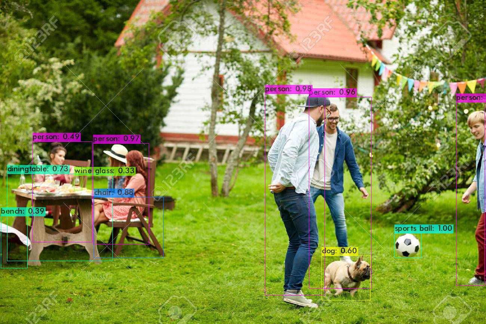
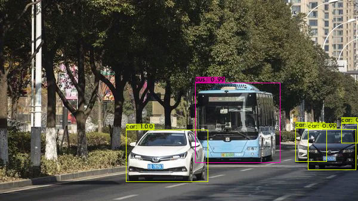

<h1 align="center">YOLO Object Detection</h1>

  
<h4>This application can recognize the sign language alphabets and help people who do not understand sign language to communicate with the speech and hearing impaired.</h4>
 

-----------------------------------------
### Output

[**Google Colab Code**](https://colab.research.google.com/drive/1EDJG3GIM8i-l_7-Y2g_YvR1nYmAn35sb?usp=sharing)

    
    

    
    

------------------------------------------
### Author

Mihir Gandhi - [mihir-m-gandhi](https://github.com/mihir-m-gandhi)
